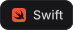
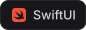
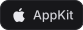
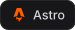
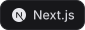
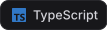

```console
$ whoami
Elior · 18 · French Alps · byelior.dev

$ ls ~/now
fovea/      freepark/      radiance/      client-sites/
```

I design, build and ship software. Native apps mostly, web when it’s the right tool.

I learn by building: every project here started as something I needed and didn’t know how to make yet. Most go from idea to release in under two weeks. I use all of them every day, which is the only test I trust.

I work alone on my own apps, and inside a team on [Radiance](https://radiancewallpapers.com). The two require completely different things. I like both.

     

#### Shipped

|  |
| :--- |
|  **[To Be Downloaded](https://tbd.yt)**<br>The macOS YouTube downloader that just works. |
|  **[Radiance Wallpapers](https://radiancewallpapers.com)**<br>I reverse-engineered their iOS app to build the webapp. That’s how I joined the team. |
|  **[noaislop.xyz](https://noaislop.xyz)**<br>A page to send to someone who published AI slop. |
|  **[Print on my desk](https://github.com/eliorpom-cmd/print-on-my-desk)**<br>A thermal printer on my desk, with a webapp in front of it. Send someone a link and what they write comes out on paper, on my desk. |
|  **[claude-bounce](https://github.com/eliorpom-cmd/claude-bounce)**<br>Bounces your editor’s Dock icon when Claude Code finishes a turn. |

#### In progress

|  |
| :--- |
|  **[Fovea](https://fovea.byelior.dev)**<br>A lightweight WYSIWYG Markdown editor: you see the result while you write it. No code view, no preview pane. |
|  **FreePark**<br>Find free street parking around you, from OpenStreetMap data. |

#### Also

Websites for small businesses in the Alps, mostly Astro, from the branding to the hosting. Available for one-off projects and long-term work with small teams.

#### Elsewhere

```console
$ contact --list
web        byelior.dev
mail       eliorpom@gmail.com
threads    @mavie.log
```

If something here saved you time, consider supporting me:

[](https://ko-fi.com/Q5W123YHYV)
